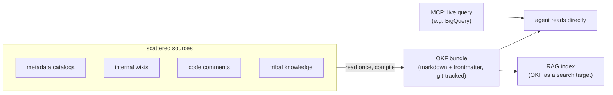

## The context-assembly problem

The failure mode OKF targets: ask an agent to "summarize last month's order data" and it can't, not because the model is weak, but because it doesn't know which tables hold the data, what the columns mean, or how the tables join. That knowledge — table schemas, metric definitions, incident runbooks, JOIN paths — already exists, just scattered across metadata catalogs, wikis, code comments, and the heads of whoever's been there longest. Every new agent re-derives it from scratch.

Google's framing (via its Cloud Blog) calls this the **context-assembly problem**, and the point is deliberate: OKF is solving an **information-silo** problem, not a **scaling** one. More compute or a bigger model doesn't help if the context needed to answer correctly was never assembled anywhere an agent can read it.

## What OKF is

OKF (**Open Knowledge Format**) is a proposed standard — currently v0.1, explicitly not finished — for **compiling** that scattered knowledge into markdown files with a small, consistent YAML frontmatter schema, version-controlled with git. It's the same shape as the "LLM wiki" idea Andrej Karpathy described: an external, agent-readable memory that both humans and models can read and write, rather than a wiki written for humans that an agent happens to scrape.

The mechanism is: instead of re-searching scattered sources every time a question comes up, someone (person or agent) reads the source once and writes the answer into an OKF bundle. Every subsequent query — by a human or an agent — reads the compiled bundle instead of repeating the search.

## OKF vs MCP vs RAG

Easy to conflate because all three sit "around" an agent's context, but they answer different questions:

| | OKF | MCP | RAG |
|---|---|---|---|
| Role | knowledge **written in advance** | protocol for **retrieving/acting on data on demand** | **semantic retrieval** over a corpus |
| Answers | "what does this metric mean, how do these tables join" | "run this query against BigQuery right now" | "find passages similar in meaning to this query" |
| Storage | git-tracked markdown bundles | none — a live connection | vector index |
| Mutually exclusive with the others? | no | no | no |

They compose: the definition of "weekly active users" lives in an OKF bundle; the actual query that computes this week's number runs live via MCP; and OKF bundles themselves can be the corpus a RAG pipeline indexes. The practical question per project isn't "which one" but "which context do we already have compiled, and where's the gap."

## LLM-wiki as running memory: Gbrain

Gbrain (open-source, from Garry Tan) is one implementation of the "LLM wiki as external memory" pattern: it embeds saved notes and retrieves them by vector similarity — "cases where a similar decision was made before," "constraints tied to this function" — rather than plain keyword search. It's bundled by default into Hermes Agent, a self-hosted assistant, so a deployed agent gets a persistent, semantically-searchable memory layer alongside whatever OKF bundles it can read. (The source article's actual VPS/Hermes install walkthrough is a hosting-provider affiliate tutorial, not reproduced here — the point worth keeping is just that this pattern already has open-source implementations, not the specific deployment steps.)

## Why this is relevant here

This wiki is already an OKF bundle in the sense above — markdown pages, a small consistent frontmatter schema, git-tracked, cross-linked (see [[index|index]]) — which is exactly the pattern this note describes rather than a coincidence. The context-assembly framing is useful mainly as the *why*: the reason to keep compiling notes here instead of re-explaining source material to an agent from scratch every time is that the second (and tenth) query should be cheaper than the first.

## Source

- Gao Dalie, ["Google OKF + Hermes Agent + Gbrain: Turn Any Folder Into a Knowledge Graph"](https://medium.com/@GaoDalie_AI/google-okf-hermes-agent-gbrain-turn-any-folder-into-a-knowledge-graph-eb91d072326d), Medium, Aug 2026 — full text saved as-is at `raw/ai-agents/google-okf-hermes-gbrain.md`.
- Google Cloud Blog, ["How the Open Knowledge Format can improve data sharing"](https://cloud.google.com/blog/products/data-analytics/how-the-open-knowledge-format-can-improve-data-sharing) — the original OKF proposal.
- Andrej Karpathy's "LLM wiki" framing: [gist](https://gist.github.com/karpathy/442a6bf555914893e9891c11519de94f).
