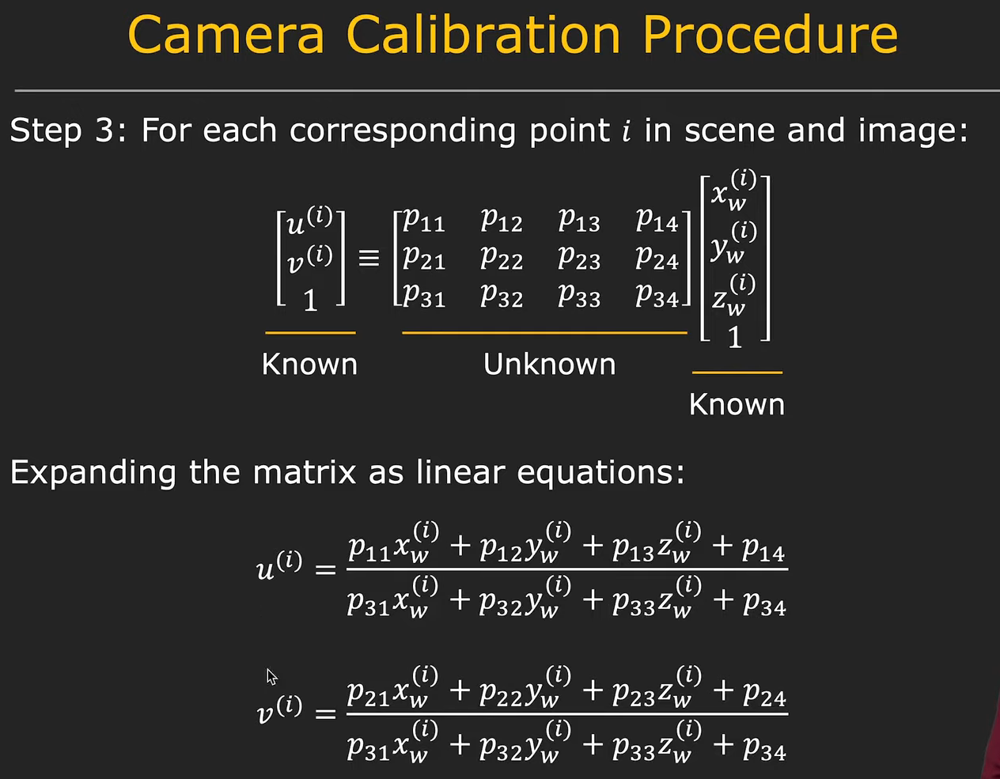
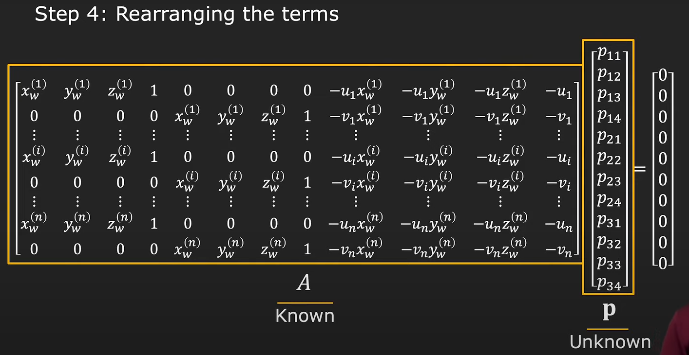
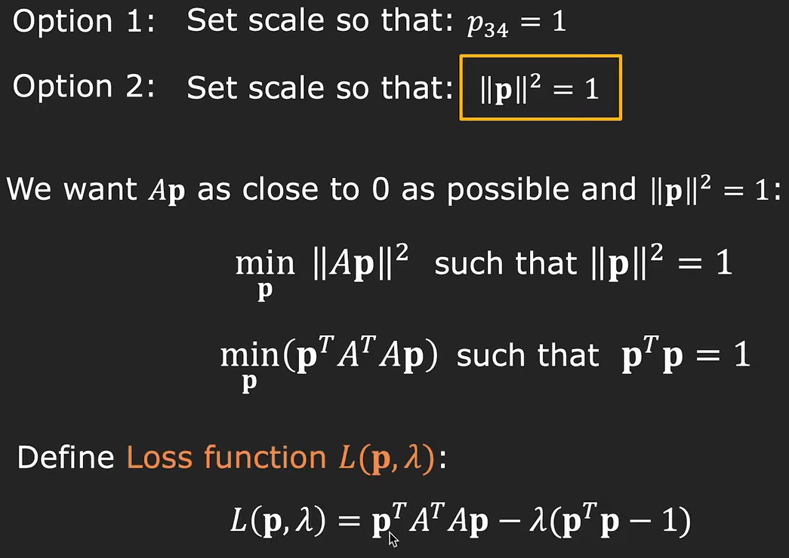
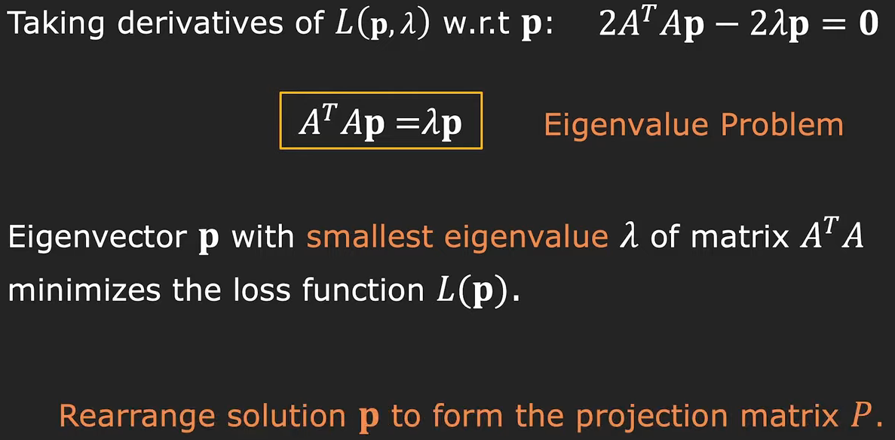
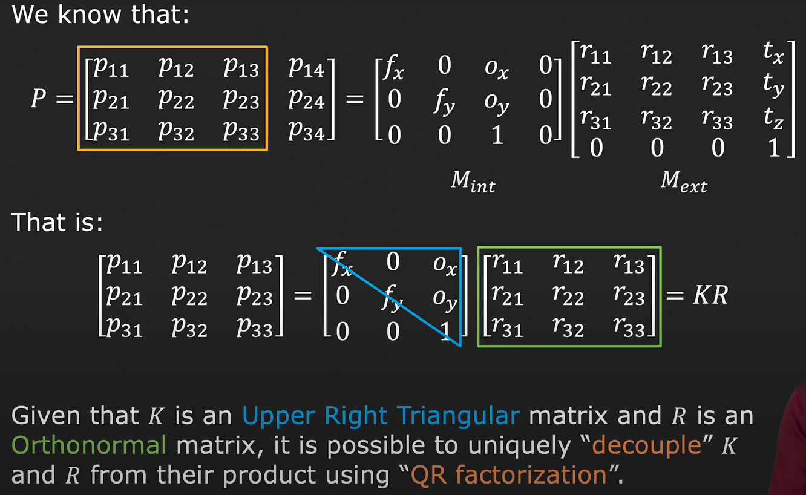
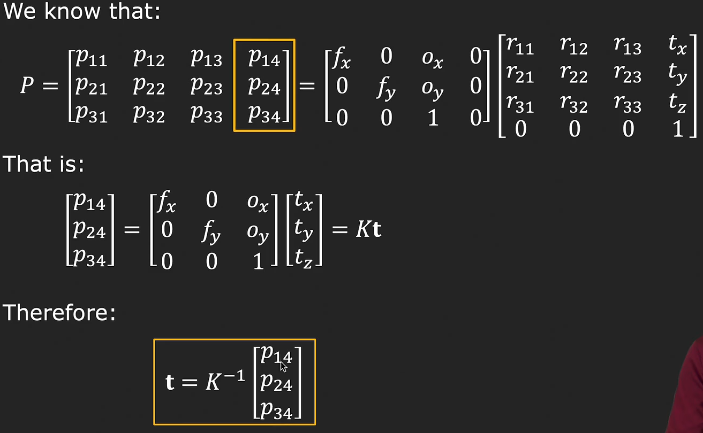
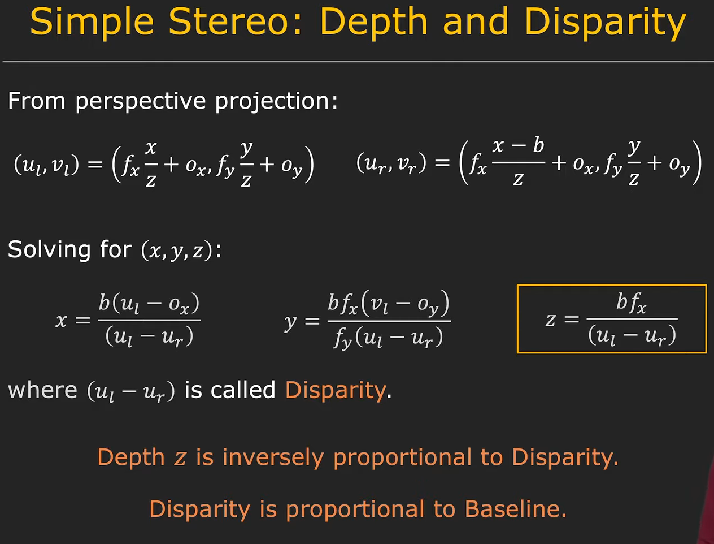

Part of [[first-principles|First Principles of Computer Vision]].

## Deriving the Projection Matrix

### Step 3

### Step 4

### Step 5

## Decompose Projection Matrix into Intrinsic and Extrinsic

## Simple Stereo

