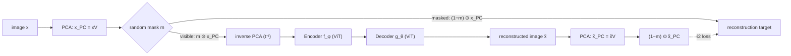

## Background: masking in pixel space

A standard Masked Autoencoder (MAE) splits an image into patches, hides a random subset (typically 75%), and trains an encoder-decoder to reconstruct the missing patches from the visible ones. Formally, given an observation $\mathbf{x} \in \mathbb{R}^D$ and complementary binary masks $\mathbf{m}, (1-\mathbf{m}) \in \{0,1\}^D$ that extract the visible and masked parts:

$$
\mathcal{L}_{\text{MAE}}(\mathbf{x}, \mathbf{m}; \theta, \phi) = \left\| (1-\mathbf{m}) \odot \left[ g_\theta \circ f_\phi (\mathbf{m} \odot \mathbf{x}) - \mathbf{x} \right] \right\|_2^2
$$

- $f_\phi$ — the **encoder**: maps the visible pixels (with positional embeddings) to a representation.
- $g_\theta$ — the **decoder**: reconstructs the masked pixels from that representation (with positional embeddings).
- $\mathbf{m}$ partitions the $D$ pixels into $(1-r)D$ visible and $rD$ masked pixels, where $r$ is the **masking ratio** — in practice, $r=0.75$ over $16\times16$ patches.

Pixel patches are inherently local, so reconstructing one leans heavily on nearby unmasked patches — the task can be solved with low-level, local cues rather than global structure, and the 75% masking ratio itself is a finicky, dataset-dependent hyperparameter.

## PCA, formally

PCA identifies the directions of highest variance in centered data $\mathbf{X} \in \mathbb{R}^{N \times D}$, by eigendecomposing the empirical covariance $\Sigma = \mathbf{X}^\top\mathbf{X} = \mathbf{V}\Lambda\mathbf{V}^\top$, where $\Lambda = \text{diag}(\lambda_1, \dots, \lambda_D)$ with $\lambda_1 > \dots > \lambda_D$, and $\mathbf{V} \in \mathbb{R}^{D\times D}$ holds the corresponding eigenvectors (the principal components).

- **Projection into PC space:** $\mathbf{X}_{\text{PC}} = \mathbf{X}\mathbf{V}$. **Inverse:** $\mathbf{X} = \mathbf{X}_{\text{PC}}\mathbf{V}^\top$.
- Component $l$'s variance is proportional to its eigenvalue $\lambda_l$.
- Components are **uncorrelated** ($\mathbf{X}_{\text{PC}}^\top\mathbf{X}_{\text{PC}} = \Lambda$) but — except in special cases like Gaussian data — **not independent**: masking one component can still leak (nonlinearly) information about the others.

## The PMAE idea, formally

PMAE keeps the MAE encoder-decoder framework but generalizes the objective to mask/reconstruct after any invertible transform $t: \mathbb{R}^D \to \mathbb{R}^D$, instead of on raw pixels:

$$
\mathcal{L}_{\text{PMAE}}(\mathbf{x}, \mathbf{m}; \theta, \phi) = \left\| (1-\mathbf{m}) \odot \left[ t \circ g_\theta \circ f_\phi \circ t^{-1}(\mathbf{m} \odot t(\mathbf{x})) - t(\mathbf{x}) \right] \right\|_2^2
$$

Setting $t = \text{identity}$ recovers the vanilla MAE objective (Eq. above) exactly — PMAE is a strict generalization, not a different mechanism. PMAE's specific choice of $t$ is the lossless PCA transform: $t(\mathbf{x}) = \mathbf{x}_{\text{PC}} = \mathbf{x}\mathbf{V}$.

Because the encoder/decoder are ViTs expecting image-shaped input, the visible components are projected back into image space via $t^{-1}$ (inverse PCA) before the encoder; the decoder's reconstruction is projected forward again via $t$ (PCA) before being compared against the masked components.

## Choosing what's visible: PMAE_ocl vs PMAE_rd

Rather than masking a fixed *count* of components (the pixel-space analogue of "75% of patches"), PMAE shuffles the components per batch and masks a fixed **share of variance**:

| Variant | Visible set explains | How $r$ is chosen |
|---|---|---|
| **PMAE$_{\text{ocl}}$** ("oracle") | exactly $100\times(1-r)\%$ of variance | $r$ tuned for downstream performance ($R_{\text{opt}} \approx 0.15$ in the paper) |
| **PMAE$_{\text{rd}}$** ("random") | between 10% and 90% of variance | $r \sim \mathcal{U}(0.1, 0.9)$, resampled every batch |

This "share of variance" framing is *why* PMAE is far less sensitive to its masking hyperparameter than MAE: variance-explained is a well-defined, comparable quantity across datasets, whereas "75% of patches" can correspond to wildly different amounts of information depending on image content.

## Why this helps

Because principal components are global (each one is a pattern spanning the whole image, ordered by variance explained), masking components rather than patches means:
- **Reconstruction targets carry more global, high-level information** — recovering a masked component requires reasoning about structure across the whole image, not filling in a locally-consistent texture.
- **Inputs and targets are smoother** (lower-frequency) than raw masked pixel patches, since each component is a smooth, global basis function rather than a hard-edged square patch.
- PMAE is **architecture-agnostic in principle** — masking units aren't tied to a 2D patch grid, so it isn't inherently coupled to patch-based ViT encoders the way pixel-space MAE is.
- Empirically, PMAE is **far less sensitive to the masking-ratio hyperparameter** than vanilla MAE.

## Results

Linear probe / MLP probe / fine-tuning top-1 accuracy (%), from Table 1 of the paper. `*` marks PMAE variants (this work); `std`/`ocl`/`rd` are the standard-75%, oracle, and random masking-ratio strategies described above.

| | | CIFAR10 | TinyIN | Derma | Blood | Path |
|---|---|---|---|---|---|---|
| Linear | MAE$_{\text{std}}$ | 41.7 | 11.5 | 72.4 | 73.4 | 83.4 |
| Linear | MAE$_{\text{ocl}}$ | 50.7 | 15.5 | 73.7 | 78.6 | 86.4 |
| Linear | **PMAE*$_{\text{ocl}}$** | **59.0** | **22.5** | **78.6** | **95.5** | **96.8** |
| Linear | MAE$_{\text{rd}}$ | 41.9 | 7.5 | 72.4 | 83.2 | 85.6 |
| Linear | **PMAE*$_{\text{rd}}$** | **44.0** | **16.9** | **76.4** | **90.0** | **90.1** |
| MLP | MAE$_{\text{std}}$ | 34.0 | 15.5 | 72.2 | 68.6 | 92.6 |
| MLP | MAE$_{\text{ocl}}$ | 55.2 | 22.2 | 74.4 | 75.8 | 95.1 |
| MLP | **PMAE*$_{\text{ocl}}$** | **64.1** | **25.1** | **80.2** | **92.5** | **98.6** |
| MLP | MAE$_{\text{rd}}$ | 38.5 | 11.6 | 66.9 | 70.6 | 95.7 |
| MLP | **PMAE*$_{\text{rd}}$** | **47.0** | **22.6** | **77.4** | **80.2** | **97.7** |
| Fine-tuned | MAE$_{\text{std}}$ | 75.7 | 37.5 | 80.4 | 97.8 | 99.7 |
| Fine-tuned | MAE$_{\text{ocl}}$ | 80.5 | 42.8 | 79.9 | 98.1 | 99.7 |
| Fine-tuned | **PMAE*$_{\text{ocl}}$** | **84.8** | **44.5** | **82.3** | **98.1** | **99.7** |
| Fine-tuned | MAE$_{\text{rd}}$ | 77.3 | 39.7 | 79.6 | 97.4 | 99.6 |
| Fine-tuned | **PMAE*$_{\text{rd}}$** | **80.4** | **46.9** | **82.4** | **98.5** | **99.7** |

PMAE beats its matched MAE baseline (same probe type, same masking-ratio strategy) in every single row above — biggest gap under linear probing (e.g. Blood: 95.5 vs 78.6 for the oracle strategy), smallest once fine-tuning gives MAE room to adapt away its worse initial representation.

## Relation to standard MAE

| | MAE | PMAE |
|---|---|---|
| Masking unit | Pixel patch (local, fixed spatial grid) | Principal component (global, ordered by variance) |
| Reconstruction target | Raw pixels of masked patches | Masked PCA components |
| Sensitivity to mask ratio | High — needs careful tuning (~75% typical) | Lower |
| Architecture constraint | Naturally suited to patch-based ViT encoders | Not tied to a spatial grid; CNN-compatible |

## Source

- Blog writeup: [64. PMAE - Principal Masked Autoencoder](https://mlhonk.substack.com/p/64-pmae-principal-masked-autoencoder) (Machine Learning with a Honk)
- Underlying paper: Bizeul et al., ["From Pixels to Components: Eigenvector Masking for Visual Representation Learning"](https://arxiv.org/abs/2502.06314), arXiv:2502.06314 — the equations and results table above are transcribed directly from the paper (Eq. 2.1, 3.1, §3, Table 1).
- Code: [alicebizeul/pmae](https://github.com/alicebizeul/pmae)

*Note: the substack domain itself is still unread (unreachable from this environment's network policy) — the writeup above is sourced directly from the arXiv paper, not the blog post. Worth a skim of the original post for the author's own framing/commentary.*
